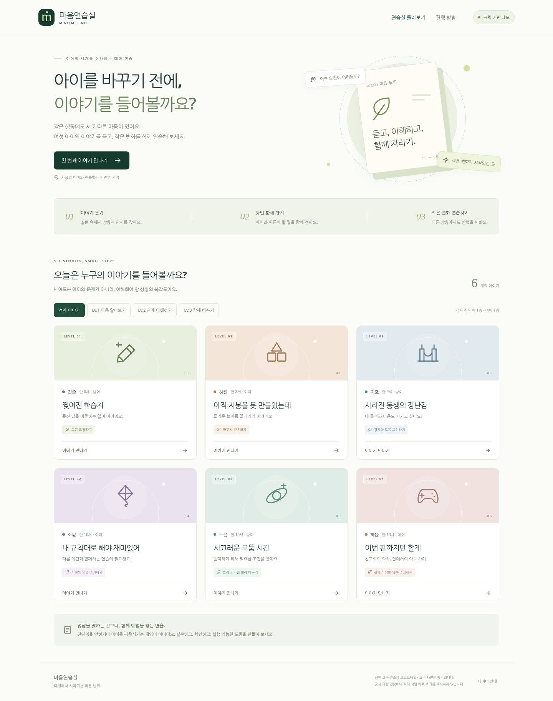

# 마음연습실 · Maum Lab

**이해에서 시작되는 작은 변화.**

교사·보호자 등 성인이 가상의 아동과 대화하며 상황을 이해하고, 함께 방법을 정한 뒤 두 장면에서 적용하는 교육·연습용 프로토타입입니다.

| 항목 | 제안 / 상태 |
|---|---|
| 서비스명 | 마음연습실 |
| 설명명 | 아동 이해·대화 시뮬레이터 |
| 저장소명 | `maum-lab` · 초기 비공개 권장 |
| 제안 주소 | `maum.hyunwoo.ai` · DNS 설정/기존 사용 여부 미확인 |
| 버전 | `0.1.0` |
| 실행 기본값 | 규칙 기반 데모, LLM 호출 없음 |
| GitHub 게시 | 아직 수행하지 않음. 계정 연결 필요 |
| 실제 AI 호출 | 연동 코드는 포함. 실 API 키를 사용한 검증은 미수행 |

대한민국 교육부 관련 프로젝트라는 요청 맥락을 반영한 **독립 프로토타입**입니다. 기관의 공식 서비스·인증·승인을 표시하지 않습니다. 모든 사례는 창작이며 진단이나 치료를 제공하지 않습니다. 교육·상담 효과에 대한 전문가 검증은 아직 없습니다.

## 바로 실행

Node.js 22.16 이상을 준비한 뒤:

```sh
cd maum-lab
npm start
```

브라우저에서 `http://localhost:3000`을 엽니다. 추가 npm 의존성 설치가 없습니다. 개발 중 파일 변경을 반영하려면 `npm run dev`를 사용하세요. HTML 파일을 직접 여는 것이 아니라 Node 서버로 실행해야 합니다.

사연을 고르고 안내를 확인한 뒤, **질문 도우미의 예시 → 전송**으로 첫 판의 흐름을 확인할 수 있습니다. Lv.2와 Lv.3에서는 질문 도우미를 직접 펼치면 됩니다. 데모의 판정은 키워드 규칙이므로 표현을 놓칠 수 있으며, 자연어 이해를 검증한 모델이 아닙니다.

## 화면 미리보기



대화 화면과 모바일 화면은 `docs/screenshots/`에 있습니다. 배포된 서비스가 아니라 로컬 렌더링 캡처입니다.

## 구현한 기능

- 만 8~10세 가상 아동 6명: 난이도 3단계마다 남아 1명·여아 1명.
- 난이도 필터, 프로필, 관심사·강점, 텍스트 대화, 질문 도우미.
- 서버에 고정한 비공개 사연, 대화 근거 ID를 붙인 단서 노트.
- `상황 이해 → 아이와 합의 → 주변 지원 확인 → 연습 → 다른 상황 적용` 게이트.
- 결과 화면과 **대화 전문을 제외한** 가상 연습 결과 JSON 내보내기.
- 규칙 기반 데모와 서버 측 LLM 연동 모드 분리.
- 공통 연기/판정 프롬프트 및 LLM을 이용한 추가 프롬프트 초안 제작 스크립트.
- 입력 길이·턴 제한, 세션 단위 속도 제한, 중복 요청 방지, 세션 삭제.
- 모바일 레이아웃, 키보드 입력, 한국어 IME 입력 처리, 안내 대화상자.
- 자동 테스트 33개, GitHub Actions 설정, Dockerfile, 비공개 저장소 게시 스크립트.

## 사연 구성

| 난이도 | 캐릭터 | 사연 | 연습 주제 |
|---|---|---|---|
| 1 | 민준 · 만 8세 · 남아 | 찢어진 학습지 | 도움 요청하기 |
| 1 | 하린 · 만 8세 · 여아 | 아직 지붕을 못 만들었는데 | 마무리 약속하기 |
| 2 | 지호 · 만 9세 · 남아 | 사라진 동생의 장난감 | 경계와 도움 표현하기 |
| 2 | 소윤 · 만 10세 · 여아 | 내 규칙대로 해야 재미있어 | 서로의 의견 조정하기 |
| 3 | 도윤 · 만 10세 · 남아 | 시끄러운 모둠 시간 | 환경과 지원 함께 바꾸기 |
| 3 | 하윤 · 만 10세 · 여아 | 이번 판까지만 할게 | 관계와 생활 약속 조정하기 |

난이도는 아이의 가치나 문제의 심각도가 아니라, 파악할 상황의 복잡도를 뜻합니다. 성별에 따른 별도 판정 규칙은 없습니다.

## 실제 LLM 연결

```sh
cp .env.example .env.local
```

`.env.local`에서 다음을 설정합니다. **실제 키나 접근 코드를 Git에 커밋하지 마세요.**

```dotenv
LLM_MODE=live
OPENAI_API_KEY=YOUR_PRIVATE_API_KEY
OPENAI_MODEL=gpt-4.1-mini
PILOT_ACCESS_CODE=REPLACE_WITH_A_RANDOM_CODE_AT_LEAST_16_CHARACTERS
APP_ORIGIN=http://localhost:3000
```

`PILOT_ACCESS_CODE`는 자신이 정한 충분히 긴 임의 코드로 교체해야 합니다. 예시 문자열 그대로 운영하지 마세요. 로컬에서 우선 검증하고, 외부 배포 시 HTTPS와 별도 접근 통제를 적용하세요.

서버를 다시 실행하면 시작 창에 AI 전송 안내 동의와 접근 코드 입력이 나타납니다. 모델 이름은 환경 변수로 교체할 수 있습니다. 모델 접근 권한과 비용 한도는 운영 계정에서 확인하세요.

판정자와 연기자를 분리해 OpenAI Responses API에 호출합니다. JSON Schema와 런타임 검증을 함께 사용하며, 서버만 상태를 변경합니다. API 오류가 발생하면 데모로 몰래 전환하지 않고 현재 상태를 유지합니다.

`store: false`를 사용하지만 **공급자 측 보관이 전혀 없다는 보장은 아닙니다**. 실제 개인정보·민감 사례는 넣지 마세요. 관련 설정은 OpenAI의 데이터 제어 안내를 확인해야 합니다.

## LLM으로 프롬프트 만들기

```sh
# 지정한 한 사연만 생성
npm run prompts:generate -- minjun

# 여섯 사연을 순차 생성
npm run prompts:generate
```

`prompts/meta.md` + 고정된 가상 사연 + 공통 프롬프트를 입력으로 사용합니다. 결과는 `content/generated/` 아래에 `draft-not-reviewed` 상태로 저장되고, 기본적으로 Git 추적에서 제외됩니다.

이 결과는 **자동 적용되지 않습니다**. 사람이 검토한 내용을 공통 프롬프트의 사례별 지침에 반영하고, 테스트를 실행한 뒤 별도 커밋으로 승인해야 합니다. 모델이 만든 초안을 같은 모델이 평가했다는 것만으로 교육·상담적 타당성이 입증되지는 않습니다.

## 테스트

```sh
npm run check
npm test
```

2026-09-27 작업 환경 기준: Node.js `v22.16.0`, 문법 검사 11개 모듈 통과, 자동 테스트 **33/33 통과**. 여섯 사연의 전체 진행, 성급한 성공 방지, 위협·프롬프트 변경 처리, 개인정보 패턴 차단, API 계약, 상태 무결성, 오류 시 롤백 등을 포함합니다.

브라우저 확인은 환경의 네트워크 제한 때문에 **오프라인 Chromium 렌더링 + 로컬 Node API 브리지**로 진행했습니다. 1440px 데스크톱에서 사연 선택·필터·민준 전체 진행을 확인했고 JavaScript 오류가 없었습니다. 390px 모바일 홈 화면에 가로 넘침이 없었습니다. 실제 공개 URL·TLS·DNS·외부 LLM 호출 검증은 수행하지 않았습니다.

`docs/QA.md`에 검증 범위와 한계를 적었습니다.

## GitHub에 올리기

이 전달물 자체가 GitHub에 게시되어 있다는 뜻은 아닙니다. 원격 저장소는 별도의 계정 연결/권한이 필요합니다.

본인 PC에서 GitHub CLI에 로그인되어 있고 Git 작성자 정보가 설정되어 있다면:

```sh
gh auth login
npm run repo:publish
```

스크립트는 인증된 **본인 계정의 `maum-lab`을 비공개로 생성**합니다. 같은 이름의 저장소 또는 `origin`이 이미 있으면 중단하며 덮어쓰지 않습니다. 비공개 여부를 바꾸거나 조직 계정으로 옮기는 작업은 포함하지 않습니다. 공개 라이선스도 임의로 부여하지 않았습니다.

## 디렉터리

```text
public/                 화면, 스타일, 브라우저 동작
src/cases.mjs           6개 고정 가상 사연 — 서버 전용
src/engine.mjs          단계·근거·클리어 조건
src/provider.mjs        구조화된 LLM 연동, 연기/판정 역할 분리
src/guardrails.mjs      프로토타입 입력 방어
src/server.mjs          HTTP API, 세션, 제한, 정적 자산
prompts/                actor / judge / meta
scripts/                검사, 프롬프트 초안 생성, GitHub 게시
content/                콘텐츠 검토 절차
tests/                 엔진, API 계약, 서버 테스트
docs/                  기획, 배포, 안전, QA
.github/workflows/      자동 검사
```

## 배포 범위

현재 세션은 **단일 Node 프로세스의 메모리**에 있습니다. 데이터베이스 없이 시연하는 목적이며 서버 재시작 시 사라집니다. 외부 배포는 지속 실행 Node/Docker와 TLS 프록시를 전제로 합니다. Vercel 등 함수형 서버리스 환경에 이 상태로 올리면 인스턴스 간 세션·제한이 공유되지 않으므로 그대로 사용하지 마세요. 해당 환경으로 옮기려면 외부 세션 저장소·분산 제한·인증을 먼저 도입해야 합니다.

`docs/DEPLOYMENT.md`, `docs/SAFETY.md`, `docs/PRODUCT.md`를 참고하세요.

## 확인한 기술 문서

- OpenAI Structured Outputs: https://developers.openai.com/api/docs/guides/structured-outputs
- OpenAI Data Controls: https://developers.openai.com/api/docs/guides/your-data
- OpenAI GPT-4.1 mini 모델: https://developers.openai.com/api/docs/models/gpt-4.1-mini
- GitHub CLI 저장소 생성: https://cli.github.com/manual/gh_repo_create
- Cloudflare 서브도메인 DNS: https://developers.cloudflare.com/dns/manage-dns-records/how-to/create-subdomain/

문서 참고는 해당 업체나 교육기관의 승인·제휴를 의미하지 않습니다.
